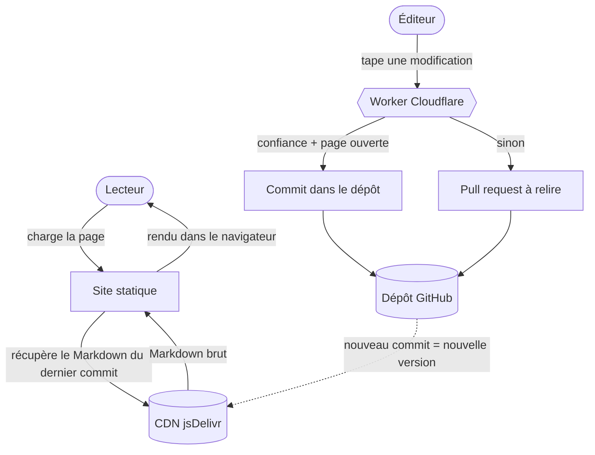

# Comment ça marche

Wikigit se divise nettement en deux chemins : un **chemin de lecture** qui ne
nécessite aucun serveur, et un **chemin d'écriture** qui en nécessite exactement
un. Comprendre cette division explique presque toutes les décisions de
conception.

## Le chemin de lecture

La lecture ne demande **aucun backend**. Le site est un ensemble de pages HTML
statiques hébergeables n'importe où. Pour chaque page, le navigateur récupère le
Markdown brut depuis un CDN gratuit, épinglé au **dernier commit** du dépôt, puis
l'affiche.

L'astuce clé : chaque commit possède un identifiant unique, donc chaque version
d'un fichier a sa propre URL permanente. Un nouveau commit donne une nouvelle URL
— d'où une **fraîcheur instantanée et un cache permanent à la fois**, et surtout
**aucune reconstruction du site** quand le contenu change.

## Le chemin d'écriture

Enregistrer une modification doit, d'une manière ou d'une autre, devenir un
commit dans le dépôt. Un commit exige un identifiant d'écriture, et **cet
identifiant ne peut jamais être envoyé au navigateur** — n'importe qui pourrait
l'extraire. Quelque chose que nous exécutons doit donc le détenir.

Ce « quelque chose » est **un petit Worker Cloudflare**, la seule infrastructure
que Wikigit fait tourner. À la publication, il dérive votre pseudonyme, vérifie
les limites de débit, les bannissements et une passe anti-vandalisme, puis soit
**écrit directement le commit** (si vous êtes de confiance et la page ouverte),
soit **ouvre une pull request** pour relecture.

## Pourquoi exactement un serveur

On demande souvent si le Worker peut être supprimé. Non, pour deux raisons
structurelles : les écritures anonymes ont besoin d'un identifiant détenu côté
serveur (le navigateur ne peut pas le garder en sécurité), et on ne peut pas
réutiliser la session GitHub du lecteur (un cookie limité à github.com). Zéro
infrastructure **et** édition sans compte sont donc incompatibles. Un Worker
gratuit est le prix irréductible — et il reste invisible pendant que vous éditez.

## Identité sans compte

Wikigit ne gère aucun système de comptes. L'identité attachée à un commit est
soit un **pseudonyme anonyme** `anon-<hash>`, dérivé de votre adresse réseau par
une clé secrète, soit votre **identité GitHub** si vous vous connectez. Une
adresse IP ou un e-mail brut n'est **jamais** écrit dans le dépôt.

## Voir aussi

- [[concepts|Concepts expliqués]] — les mots ci-dessus, en clair.
- [[demarrer|Démarrer]] — faites votre première modification.
