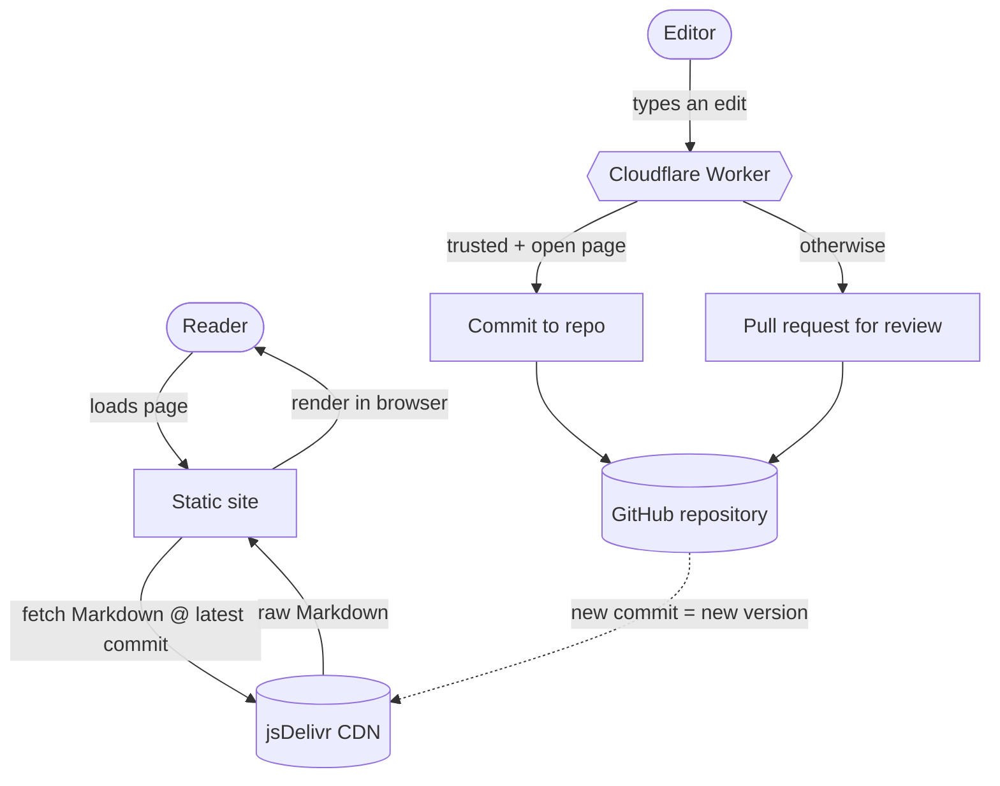

# How it works

Wikigit splits cleanly into two paths: a **read path** that needs no server, and
a **write path** that needs exactly one. Understanding the split explains almost
every design decision.

## The read path

Reading needs **no backend at all**.

1. The site is a set of static HTML shells, hostable on any static host.
2. For each page, the browser fetches the raw Markdown from a free CDN
   ([jsDelivr](https://www.jsdelivr.com/github)), pinned to the repository's
   **latest commit**.
3. The browser renders that Markdown into the page you see.

The key trick: each commit has a unique identifier (a [[concepts|SHA]]),
so each version of a file has its own permanent URL. A new commit means a new
URL, which means **instant freshness and permanent caching at the same time** —
no cache to purge, and crucially **no site rebuild when content changes**. Edit a
file, and the next reader gets the new version as soon as the CDN refreshes.

## The write path

Saving an edit must, somehow, become a commit in the repository. A commit needs
a credential that can write to the repository, and **that credential can never
be shipped to the browser** — anyone could extract it. So something we run must
hold the credential and turn "a person typed text" into a commit.

That something is **one small [[concepts|Cloudflare Worker]]**.
It is the only piece of infrastructure Wikigit runs. When you publish an edit,
the Worker:

1. Derives your anonymous pseudonym from your network address (a one-way hash —
   see [below](#identity-without-accounts)).
2. Checks rate limits, bans, and an anti-vandalism rule pass.
3. Either **commits the change directly** (if you are trusted and the page is
   open) or **opens a pull request** for a maintainer to review.

Either way the change ends up as a commit, and the read path above picks it up
with no rebuild.

## Why exactly one server

People often ask whether the Worker can be removed to make Wikigit truly
zero-infrastructure. It cannot, for two structural reasons:

- **Anonymous writes need a server-held credential.** The browser cannot hold
  the write credential safely, so a server must.
- **You cannot reuse the reader's existing GitHub login.** A GitHub session is a
  cookie scoped to github.com; browsers deliberately prevent other sites from
  using it. So "already logged in to GitHub" cannot be borrowed.

Zero-infrastructure *and* no-account editing are therefore mutually exclusive.
One free Worker is the irreducible price — and it is invisible to you while you
edit. The rejected alternatives (bring-your-own token, an "Edit on GitHub"
link-out, login-only editing) all fail the no-account, in-site bar.

## Identity without accounts

Wikigit never runs its own account system. The identity attached to a commit is
either:

- an **anonymous pseudonym**, `anon-<hash>`, derived by hashing your network
  address with a secret key the Worker keeps to itself; or
- your **GitHub identity**, if you chose to sign in.

A raw IP address or email is **never** written into the repository. Because only
a one-way hash is stored, there is no "reveal the IP" capability — by design,
which is a stronger privacy guarantee than most wikis offer. The trade-offs are
covered in [[governance|Governance]].

## Where everything lives

| Wiki need | Provided by |
|---|---|
| Versioned storage | git commits |
| File storage & hosting | a GitHub repository |
| Global delivery | the jsDelivr CDN |
| Discussion / talk | GitHub Discussions |
| Compute for edits | one Cloudflare Worker |
| Revision history | `git log` (it is free) |
| Export / backup | `git clone` (also free) |

## See also

- [[concepts|Concepts explained]] — the words used above, in plain language.
- [[features|Features]] — what this architecture makes possible.
- [[governance|Governance & moderation]] — how open editing stays safe.
