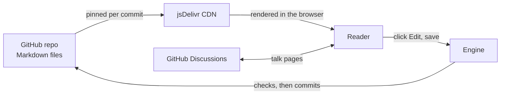

# Architecture

Most wikis are a program sitting in front of a database. Wikigit is closer to the opposite: there is no database, and there is almost no program. The pages live in a [[w:Git|Git]] repository, reading is handled by a public [[w:Content delivery network|CDN]], and the one piece anyone actually has to run is a small server, the **Engine**, that saves edits.

The clearest way to see it is to follow a page in each direction — out to a reader, and back from an editor.

## Reading: no rebuild, no wait

When you open a page, the browser fetches its Markdown file from the CDN and renders it on the spot. The file is requested at a specific commit, so every saved version has its own permanent address. A new edit is a new commit, which is a new address, which the site starts pointing at immediately.

This is why a change appears the moment the next person loads the page. There is nothing to rebuild and no cache to clear, because old versions never need to change — they simply stop being the latest one.[^cdn] A static reader shell, hosted anywhere that serves files, is all that has to be online for reading to work.

## Writing: the Engine

Reading is free because files on a CDN don't need a server. Writing is the part that does, and Wikigit keeps it as small as it can be.

When someone saves an edit, it goes to the Engine — a single [Bun](https://bun.sh/) server. The Engine holds the one credential that can write to the repository, so the visitor never sees a token or a password. Before committing, it does the work that keeps the wiki safe: it derives an anonymous identity for the editor, applies rate limits, checks the change against the ban list and any filters, and then writes a commit on the author's behalf. Sign-in, when used, runs through the same Engine.

Notably, the Engine keeps no database. The little state it needs lives in memory and in the Git repository itself, rebuilt from the repo when the process restarts. So a self-hosted copy is one Bun process behind a reverse proxy, with nothing to back up but the repo. wikigit.org runs a shared instance that hosts many wikis at once, free for the people using them.

Why this can't be folded away into "just GitHub" is an argument of its own, but the short version is that letting strangers edit *without* an account means something trusted has to stand between them and the repository. That something is the Engine, and it is the only custom infrastructure in the whole system.

## GitHub is the backend

The reason there is so little to build is that most of a wiki already exists as a service. Wikigit borrows each part rather than rebuilding it.

| What a wiki needs | Borrowed from | What Wikigit adds |
|---|---|---|
| Versioned storage | Git commits | — |
| Hosting for reads | CDN ([[w:jsDelivr|jsDelivr]]) | — |
| Compute for edits | The Engine (a Bun server) | the relay logic |
| Discussion layer | [[w:GitHub|GitHub]] Discussions | — |
| Optional sign-in | GitHub OAuth | — |
| Anonymous identity | a derived hash, stored nowhere | the derivation |
| Moderation | pull requests and review | the policy |

Each row that says "—" is a part nobody has to write or operate. What's left is thin enough to read in an afternoon.

## What this buys, and what it costs

The upsides fall out of the design. Reading scales like any static site and costs nothing. History is real Git history, so it is complete and portable. Your content is never trapped, because it is just files in your own account.

The trade-offs are honest ones. There is no live collaborative cursor — two people editing the same page resolve it the way Git does, not the way a shared document does. And the system leans on GitHub and a CDN being up; if the editor is briefly unreachable, people can still read, and editing resumes when it returns. Since the content is plain files, an outage is an inconvenience, never a loss.

## See also

- [[editing-model|Editing model]] — what happens to an edit after the Worker accepts it.
- [[anonymous-editing|Anonymous editing]] — how a visitor gets an identity without an account.
- [[revisions|Revision history]] — the reading side of Git history.

## References

[^cdn]: Pinning each request to a commit hash is what makes the content both instantly fresh and permanently cacheable. See [jsDelivr's GitHub CDN](https://www.jsdelivr.com/github).

{{shared/concepts-navbox}}
